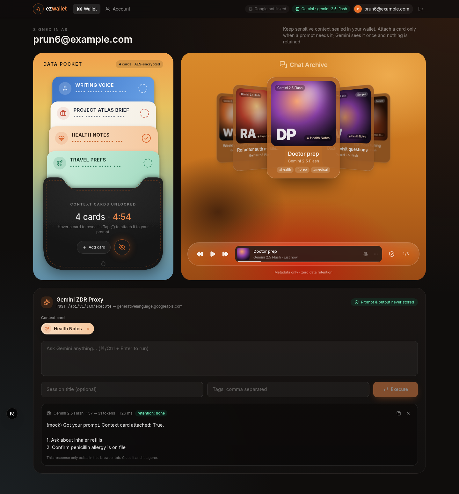
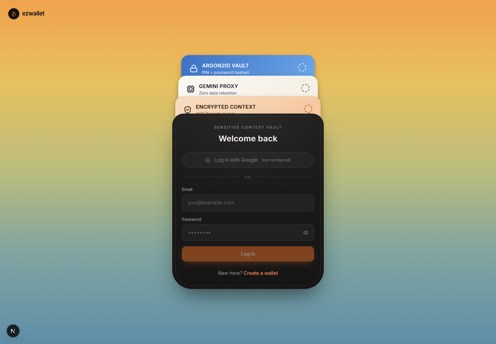
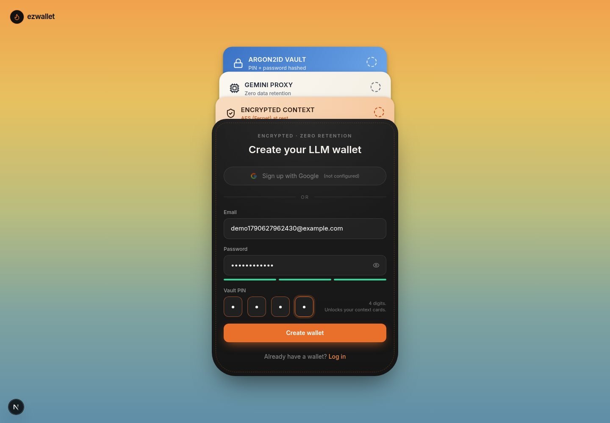
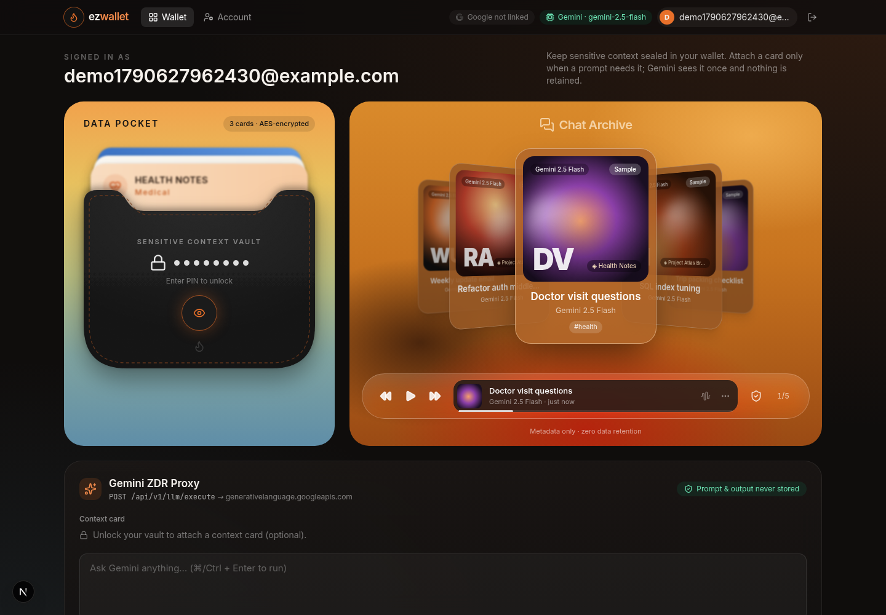
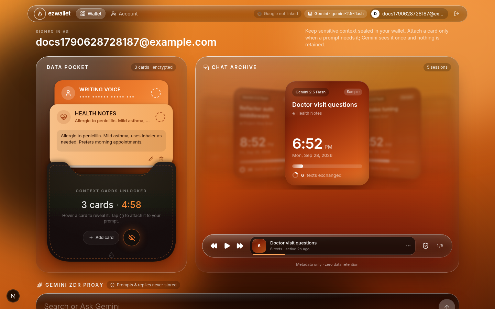
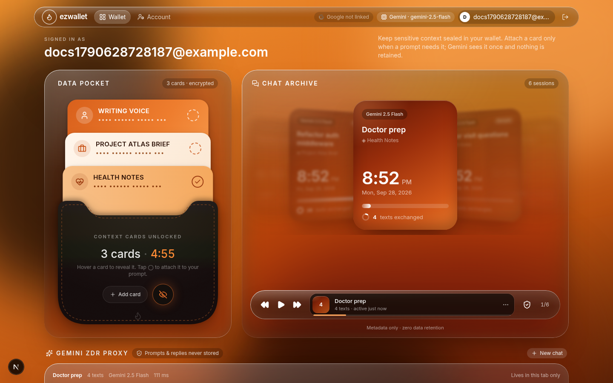
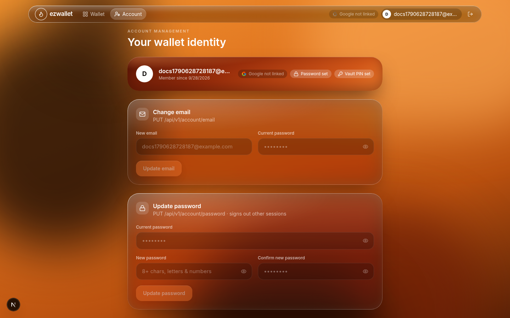

# EZ Wallet: LLM Data Wallet

A full-stack **LLM Data Wallet**. You keep sensitive context (a writing voice, a project brief, health notes, and so on) in an **encrypted, PIN-locked card vault**. When a prompt needs a card, you attach it and the prompt goes through a **zero-data-retention (ZDR) proxy to Google Gemini**. Past sessions appear in a cover-flow archive that stores **metadata only**: when each chat happened and how many texts were exchanged, never what was said.

| Layer | Stack |
|---|---|
| Frontend | Next.js 15 (App Router) · TypeScript · Tailwind CSS · Framer Motion · Lucide React · one typeface (Inter), an orange + black palette, liquid-glass surfaces |
| Backend | FastAPI · SQLAlchemy 2 · Alembic · SQLite (`wallet.db`) locally, PostgreSQL (Neon) in production |
| Hosting | Vercel (frontend) · Render (API) · Neon (PostgreSQL), all free tier. See **[DEPLOY.md](DEPLOY.md)** |
| Security | argon2id (passlib) · PyJWT in HTTP-only cookies · Fernet (AES-128-CBC + HMAC-SHA256) at rest · Google Identity Services |
| LLM | Gemini REST API (`generativelanguage.googleapis.com`), `gemini-2.5-flash` by default |



---

> **Live deployment:** follow **[DEPLOY.md](DEPLOY.md)** to put this on the web for free (Vercel + Render + Neon) in about 20 minutes.

## 1. Quick start

**Prerequisites:** Python 3.11+ and Node.js 20+.

### Backend (FastAPI on :8000)

```bash
cd backend
python -m venv .venv
source .venv/bin/activate            # Windows: .venv\Scripts\activate
pip install -r requirements-dev.txt
python scripts/init_env.py           # creates .env with fresh JWT_SECRET + WALLET_ENCRYPTION_KEY
# optional: edit .env to add GEMINI_API_KEY and GOOGLE_CLIENT_ID
uvicorn app.main:app --reload --port 8000
```

Database migrations run **automatically on startup**. API docs are at http://localhost:8000/docs.

### Frontend (Next.js on :3000)

```bash
cd frontend
cp .env.local.example .env.local     # optional: add NEXT_PUBLIC_GOOGLE_CLIENT_ID
npm install
npm run dev
```

Open **http://localhost:3000**. It redirects to `/login`. Choose "Create a wallet" to register.

> The browser only talks to `localhost:3000`. Next.js proxies `/api/*` to FastAPI (see `frontend/next.config.mjs`), so the session cookie is first-party and HTTP-only, and CORS never comes into play.

### Run the tests

```bash
cd backend && pytest -q          # 32 tests: status codes, hashing, encryption, ZDR, ownership, sessions, migrations
# same suite against PostgreSQL (what production uses):
TEST_DATABASE_URL=postgresql://user@localhost:5432/ezw_test pytest -q
cd frontend && npm run typecheck && npm run build
```

---

## 2. Walkthrough: test login and persistence

1. **Register** at `/register` with an email, a password (8+ characters, letters and numbers) and a **4-digit vault PIN**. New accounts get 3 starter cards and 5 sample chat summaries (turn this off with `SEED_DEMO_DATA=false`).
2. **Dashboard.** The top bar shows your email, Google-link status and Gemini status.
   - **Data Pocket (left):** the cards peek out of the leather pocket, blurred. Click the **orange eye** and enter your PIN, and the cards slide up out of the pocket.
   - **Hover** a card to reveal its secret. Move the mouse away and it is masked again at once. On touch screens, tap to toggle.
   - Tap the dashed **◯** on a card to attach it to your prompt (it turns into a ✓).
   - **Chat Archive (right):** a 3D cover flow. Each card shows the date and time of the chat, with **how many texts were exchanged** as the subtext. The front card is opaque, and cards further back are progressively blurred and faded. Drag it, use the ◀◀ ▶ ▶▶ controls or the arrow keys, or click a side card.
   - **Gemini ZDR Proxy (bottom):** a "Search or Ask" pill. Press Enter to send. Attach a context card from the list below it (or press ⌥1–⌥9). Keep replying to continue the same session, and its text count goes up. **New chat** starts over. The transcript lives only in the browser tab.
3. **Account** (`/account`): change your email, password or vault PIN, or delete the account.
4. **Check persistence:** stop uvicorn (Ctrl+C), start it again, and log in. Your cards, chat summaries and credentials are all still there, because they live in `backend/wallet.db`.

```bash
# Inspect the DB directly: card contents are ciphertext, hashes are argon2id
sqlite3 backend/wallet.db "select email, substr(password_hash,1,30) from users;"
sqlite3 backend/wallet.db "select label, substr(content_encrypted,1,20) from wallet_cards;"
```

---

## 3. Architecture

```
┌──────────── Browser (localhost:3000) ────────────┐
│ /login /register /dashboard /account             │
│ WalletContainer · CoverFlowSlider · LlmConsole   │
└───────────────┬──────────────────────────────────┘
                │ fetch('/api/v1/...')  (cookie: ezw_session, ezw_vault; HTTP-only)
┌───────────────▼──────────────────────────────────┐
│ Next.js server: rewrite /api/* → BACKEND_URL     │
└───────────────┬──────────────────────────────────┘
                │
┌───────────────▼──────────── FastAPI (:8000) ─────┐
│ routers/auth     register · login · google · me  │
│ routers/account  email · password · pin · delete │
│ routers/wallet   cards · unlock · lock · CRUD    │
│ routers/chats    list · get · delete (metadata)  │
│ routers/llm      status · execute ──────────────────► generativelanguage.googleapis.com
│ security.py  argon2id · JWT · Fernet             │      (x-goog-api-key header)
│ Alembic migrations run in lifespan()             │
└───────────────┬──────────────────────────────────┘
                │ SQLAlchemy
          backend/wallet.db (SQLite, WAL mode, FK cascade) locally
          Neon PostgreSQL (TLS, pooled + pre-ping) in production
```

### Repository layout

```
backend/
  app/
    main.py          app factory, lifespan migrations, 422→400 handler, security headers
    config.py        pydantic-settings; secrets are required, with no defaults
    database.py      engine, session, SQLite pragmas / Postgres pool settings
    models.py        User, WalletCard, ChatSummary
    schemas.py       request/response models and validation
    security.py      argon2id, JWT, Fernet helpers
    deps.py          current user, vault gate, cookie helpers
    gemini.py        ZDR Gemini client
    seed.py          optional starter content
    routers/         auth, account, wallet, chats, llm
  alembic/           env.py + versions/0001_initial_schema.py
  scripts/init_env.py
  tests/             pytest suite (isolated temp DB, mocked Gemini transport)
frontend/
  src/app/           login, register, dashboard, account pages
  src/components/    WalletContainer, CoverFlowSlider, PinModal, CardEditorModal, LlmConsole, …
  src/lib/           api client, auth context, types, card themes
```

### Data model

| Table | Key columns |
|---|---|
| `users` | `email` (unique), `password_hash` (argon2id, nullable for Google-only), `pin_hash` (argon2id), `google_sub` (unique), `pin_failed_attempts`, `pin_locked_until`, `token_version` |
| `wallet_cards` | `user_id` → users (CASCADE), `label`, `category`, `color`, **`content_encrypted`** (Fernet bytes), `position` |
| `chat_summaries` | `user_id` → users (CASCADE), `title`, `model`, `tags` (JSON), `card_label`, `message_count`, `prompt_tokens`, `output_tokens`, `latency_ms`, `is_sample`, `created_at`, `updated_at` (last activity). **There are no prompt or output columns.** |

---

## 4. REST API

Base path is `/api/v1`. Every request and response body is JSON. Errors always look like `{"detail": "..."}`. Validation errors return **400** (FastAPI's default 422 is remapped) and also carry an `errors: [{field, message}]` array.

| Method & path | Body | Success | Errors |
|---|---|---|---|
| `POST /auth/register` | `{email, password, pin}` | **201** `{user, access_token, token_type}` + cookie | 400 invalid or duplicate email |
| `POST /auth/login` | `{email, password}` | **200** `{user, access_token, token_type}` + cookie | 400 invalid body, 401 bad credentials |
| `POST /auth/google` | `{credential}` (GIS ID token) | **201** new account / **200** existing | 400 not configured, 401 invalid token |
| `POST /auth/logout` | none | 200 `{message}` | |
| `GET /auth/me` | none | 200 `UserOut` | 401 |
| `GET /account` | none | 200 `UserOut` | 401 |
| `PUT /account/email` | `{new_email, current_password}` | 200 `UserOut` | 400 taken or same, 401 wrong password |
| `PUT /account/password` | `{current_password, new_password}` | 200 `{message}` (other sessions revoked) | 400 weak, 401 wrong password |
| `PUT /account/pin` | `{current_password, new_pin}` | 200 `{message}` | 400, 401 |
| `DELETE /account` | `{current_password, confirm_email}` | 200 `{message}` (cascade delete) | 400 email mismatch, 401 |
| `GET /wallet/cards` | none | 200 `{cards: CardMeta[], locked}` (**never content**) | 401 |
| `POST /wallet/unlock` | `{pin}` | 200 `{cards: CardRevealed[], expires_in_seconds}` + vault cookie | 400 no PIN set, 401 wrong PIN, 429 locked out |
| `POST /wallet/lock` | none | 200 | 401 |
| `GET /wallet/cards/revealed` | none | 200 `CardRevealed[]` | 401 vault locked |
| `POST /wallet/cards` | `{label, category, color, content}` | **201** `CardRevealed` | 400, 401 |
| `PUT /wallet/cards/{id}` | partial of the above | 200 `CardRevealed` | 400, 401, **404** |
| `DELETE /wallet/cards/{id}` | none | 200 | 401, **404** |
| `GET /chats` | none | 200 `{chats: Chat[]}` | 401 |
| `GET /chats/{id}` | none | 200 `Chat` | 401, **404** |
| `DELETE /chats/{id}` | none | 200 | 401, **404** |
| `GET /llm/status` | none | 200 `{configured, model, endpoint}` | 401 |
| `POST /llm/execute` | `{prompt, card_id?, chat_id?, history?: [{role:"user"\|"model", text}], title?, tags?}` | 200 `{output, model, chat, retention:"none"}`. With `chat_id` it continues that session and adds 2 to `message_count` | 400 (invalid, or a sample session), 401 (auth or vault locked), 404 card or chat, 502 upstream, 503 no key |

Auth accepts **either** the HTTP-only `ezw_session` cookie (browser) **or** `Authorization: Bearer <access_token>` (curl, Postman). A resource that belongs to another user returns **404**, never 403, so IDs don't leak.

```bash
# curl example (bearer flow)
TOKEN=$(curl -s -X POST localhost:8000/api/v1/auth/login -H 'content-type: application/json' \
  -d '{"email":"you@example.com","password":"Sup3rSecret!"}' | python -c 'import sys,json;print(json.load(sys.stdin)["access_token"])')
curl -s localhost:8000/api/v1/wallet/cards -H "Authorization: Bearer $TOKEN"
```

---

## 5. Environment variables

**No secret is hardcoded.** The backend refuses to start if `JWT_SECRET` or `WALLET_ENCRYPTION_KEY` is missing. Both `.env` files are git-ignored. Only the `*.example` templates are committed.

### `backend/.env`

| Variable | Required | Default | Purpose |
|---|---|---|---|
| `JWT_SECRET` | **yes** | none | HMAC key for session and vault JWTs (32+ characters) |
| `WALLET_ENCRYPTION_KEY` | **yes** | none | Fernet key that encrypts card contents |
| `DATABASE_URL` | no | `sqlite:///./wallet.db` | SQLAlchemy URL. Production uses PostgreSQL: a `postgres://` or `postgresql://` URL (as Neon gives it) is converted to the bundled `psycopg` driver automatically |
| `GEMINI_API_KEY` | no | none | From https://aistudio.google.com/apikey. Without it, execute returns 503 |
| `GEMINI_MODEL` | no | `gemini-2.5-flash` | Any `generateContent` model |
| `GEMINI_API_BASE` | no | `https://generativelanguage.googleapis.com/v1beta` | Override for testing |
| `GOOGLE_CLIENT_ID` | no | none | OAuth Web Client ID. Leave blank to disable Google sign-in |
| `ACCESS_TOKEN_EXPIRE_MINUTES` | no | `720` | Session lifetime |
| `VAULT_SESSION_MINUTES` | no | `5` | How long a PIN unlock lasts |
| `PIN_MAX_ATTEMPTS` / `PIN_LOCKOUT_MINUTES` | no | `5` / `5` | PIN brute-force throttle |
| `COOKIE_SECURE` | no | `false` | Set `true` behind HTTPS |
| `CORS_ORIGINS` | no | `http://localhost:3000` | For direct (non-proxied) API callers |
| `SEED_DEMO_DATA` | no | `true` | Starter cards and sample summaries for new accounts |

Generate the secrets by hand if you prefer:

```bash
python -c "import secrets; print(secrets.token_urlsafe(48))"                              # JWT_SECRET
python -c "from cryptography.fernet import Fernet; print(Fernet.generate_key().decode())" # WALLET_ENCRYPTION_KEY
```

### `frontend/.env.local`

| Variable | Purpose |
|---|---|
| `BACKEND_URL` | Where Next.js proxies `/api/*` (server-side only). Default `http://127.0.0.1:8000` |
| `NEXT_PUBLIC_GOOGLE_CLIENT_ID` | The same Client ID as the backend. It is public by design (Google embeds it in the page), so it is not a secret |

### Enabling Google sign-in

1. Go to Google Cloud Console → APIs & Services → Credentials → **Create OAuth client ID** → *Web application*.
2. Under **Authorized JavaScript origins**, add `http://localhost:3000` and `http://localhost`.
3. Put the Client ID in `backend/.env` (`GOOGLE_CLIENT_ID`) **and** `frontend/.env.local` (`NEXT_PUBLIC_GOOGLE_CLIENT_ID`), then restart both servers.

The browser receives a Google ID token. The backend verifies its signature, audience and expiry (`google.oauth2.id_token.verify_oauth2_token`) and requires `email_verified`, then issues our own session. A Google account whose email matches an existing account is linked to it. Google-only users are asked to set a vault PIN on the dashboard.

---

## 6. Database migrations

Alembic manages the schema, and `app/main.py` runs `alembic upgrade head` inside the FastAPI lifespan, **so a plain `uvicorn` start always leaves the DB current.** `alembic/env.py` reads `DATABASE_URL` from settings, so no connection string lives in `alembic.ini`. `render_as_batch=True` keeps `ALTER TABLE` migrations working on SQLite. Both revisions have been run up, down and up again against PostgreSQL 16.

| Revision | Change |
|---|---|
| `0001` | Initial schema: users, wallet_cards, chat_summaries |
| `0002` | Adds `chat_summaries.message_count` and `updated_at` (backfilled from `created_at`), and maps the old card skins to the orange/black palette (`sapphire→ember`, `peach→amber`, `ivory→cream`, `mint→copper`, `lilac→rust`, `graphite→noir`). Reversible |

```bash
cd backend
alembic upgrade head                                   # apply by hand (same as on startup)
alembic current                                        # show the applied revision
alembic revision --autogenerate -m "add column foo"    # after editing app/models.py
alembic downgrade -1                                   # roll back one revision
```

To reset local data, stop the server, run `rm backend/wallet.db*`, and start it again.

---

## 7. Security summary

See [JOURNAL.md](JOURNAL.md) for the reasoning behind each layer.

- **Passwords and PINs:** argon2id through passlib, with a timing equaliser for unknown emails.
- **Sessions:** HS256 JWTs in `HttpOnly; SameSite=Lax` cookies. `token_version` revokes all sessions when the password changes.
- **Vault:** a second short-lived JWT (5 minutes) that is only issued after the PIN is verified. There are 5 attempts before a 5-minute lockout (429 + `Retry-After`).
- **At rest:** card content is encrypted with Fernet. The locked card list never includes content, and the browser drops decrypted text when the vault locks.
- **Hover reveal:** unless a card is hovered, the DOM holds a fixed-length mask rather than the secret, so the text can't be selected, copied or read from the DOM, and its length isn't leaked.
- **ZDR proxy:** nothing is logged or persisted except metadata. Multi-turn sessions work by having the browser re-send the transcript it holds in memory; the server forwards it and stores only the running message count. `Cache-Control: no-store` is set. The API key travels in a header, never the URL, and buffers are scrubbed after each call.
- **Hardening:** 404 for other users' resources, `X-Content-Type-Options`, `X-Frame-Options: DENY`, `Referrer-Policy`, and cascade deletes on account removal.

### Zero data retention: what is and isn't guaranteed

This app never writes prompts, context or outputs to disk, logs or the DB, and it clears its in-process buffers after each call. Python strings are immutable, so the memory scrub is best effort. **Retention on Google's side is set by your Google Cloud / AI Studio project, not by this code.** For contractual ZDR, use a paid-tier project where Google does not use data to improve its products, or Vertex AI with zero data retention enabled. Swap `GEMINI_API_BASE` to point elsewhere.

---

## 8. Screenshots

| Login | Register |
|---|---|
|  |  |
| **Dashboard (locked)** | **Hover reveal** |
|  |  |
| **Chat archive (date, time, texts exchanged)** | **Multi-turn session + context cards** |
|  |  |
| **Account** | |
|  | |
